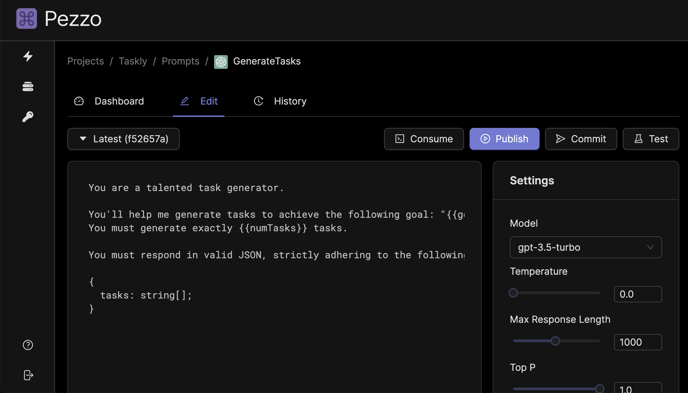

import ButtonsImg from "./buttons.png";

# Step 2: Prompt Engineering

## Create a new project and prompt

Follow the instructions below:

1. Sign in to Pezzo at [https://localhost:4200](https://localhost:4200).
2. Create a new project. You can name it whatever you want, but for this tutorial we'll call it `Taskly`.
3. Create a new prompt. Choose OpenAI as the provider, and name it `GenerateTasks`.
4. Navigate to the Editor tab.

## Prompt Engineering 🔧

It's time to engineer our prompt to produce the desired output. In our case, we want to generate a list of tasks to achieve a goal. We also want the goals to produce a JSON response, so we can process it in our example app.

### Prompt Body

In the body of the prompt, copy and paste the following:

```plaintext
You are a talented task generator.

You'll help me generate tasks to achieve the following goal: "{goal}".
You must generate exactly {numTasks} tasks.

You must respond in valid JSON, strictly adhering to the following schema:

{
  tasks: string[];
}
```

:::tip
You can interpolate variables in the prompt body by wrapping them in double curly braces. For example, `{{goal}}`.
:::

### Prompt Settings

Feel free to modify the settings to your liking. For this tutorial, we strongly recommend the following adjustments:

- **Temperature**: `0`
- **Max Response Length**: `1000`

:::tip
When expecting a JSON response, it's best to set the temperature to 0. This minimizes the chance of the response being invalid.
:::



### Testing (Optional)

If you have configured your OpenAI API key, you may now use the Test button to see the result of your prompt.

### Commit & Publish

Now we're ready to commit and publish our prompt. You can find the Commit & Publish button in the top right corner of the Editor tab.


## Step 2: Clone the example app

All demo apps can be found in the [examples GitHub repository](https://github.com/pezzolabs/examples).

Open up a terminal and clone the app:

```bash
npx degit https://github.com/pezzolabs/examples/task-generator-app task-generator-app
```

Now, navigate to the app directory and install dependencies:

```bash
cd task-generator-app
npm install
```
