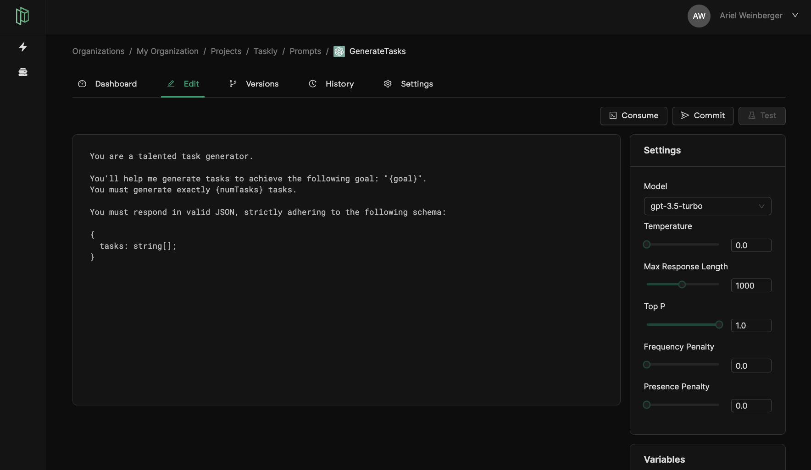

import ButtonsImg from "./buttons.png";
import EditTabsImg from "./edit-tabs.png";
import NewPromptModalImg from "./new-prompt-modal.png";

# Step 3: Prompt Engineering

## Create a new prompt

In the Prompts page, click the **+ New Prompt** button to create a new prompt, choose OpenAI as the integration, and name it `GenerateTasks`.


# The Prompt Editor
It's time to engineer our prompt to produce the desired output. In our case, we want to generate a list of tasks to achieve a goal. We want the resposne to be in JSON, so we can process it in our example app.

Head over to the **Edit** tab to get started.


## Prompt body

In the body of the prompt, copy and paste the following:

```plaintext
You are a talented task generator.

You'll help me generate tasks to achieve the following goal: "{goal}".
You must generate exactly {numTasks} tasks.

You must respond in valid JSON, strictly adhering to the following schema:

{
  tasks: string[];
}
```

:::tip
You can interpolate variables in the prompt body by wrapping them in **single** curly braces. For example, `{goal}`.
:::

## Prompt settings

Feel free to modify the settings to your liking. For this tutorial, we strongly recommend:

- **Temperature**: `0`
- **Max Response Length**: `1000`

:::tip
When expecting a JSON response, it's best to set the temperature to 0. This minimizes the chance of the response being invalid.
:::



## Testing (optional)

:::note
This step is only possible if you added the OpenAI API key in the [previous step](/docs/tutorial/provide-openai-api-key).
:::

Pezzo allows you to test your prompts before publishing them. This is a great way to quickly iterate on your prompts and make sure they're working as expected.

### To test your prompt:
1. Define test variables. You can find the **Variables** section at the bottom-right.
2. Click the **Test** button at the top-right corner.

Now, you can see the full result of your test!

## Commit and publish

Now you're ready to commit and publish our prompt.

1. Click the **Commit** button at the top-right corner and provide a useful message.
2. Click the **Publish** button at the top-right corner and select the `Development` environment.

Your prompt is now live! 🎉 In the next section, you'll learn how to consume your prompt using the demo app.

